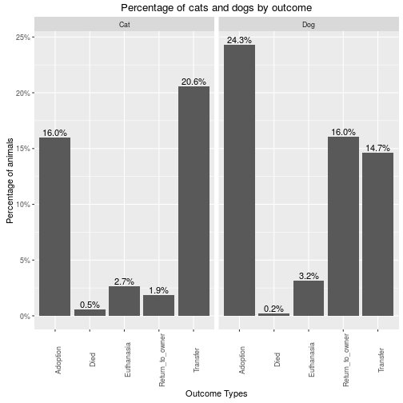
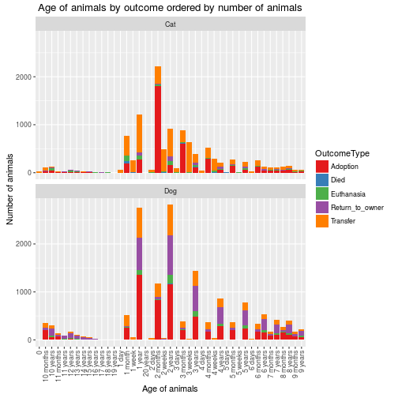
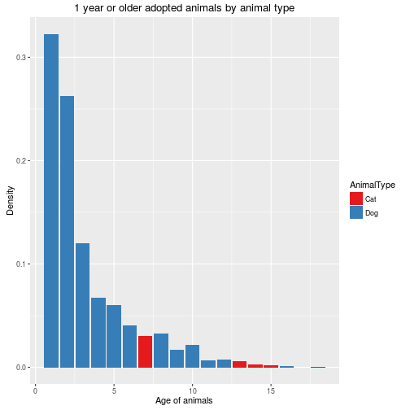
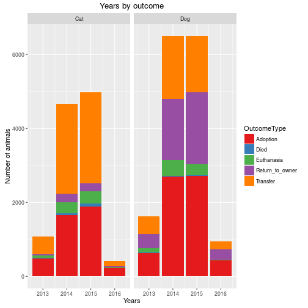
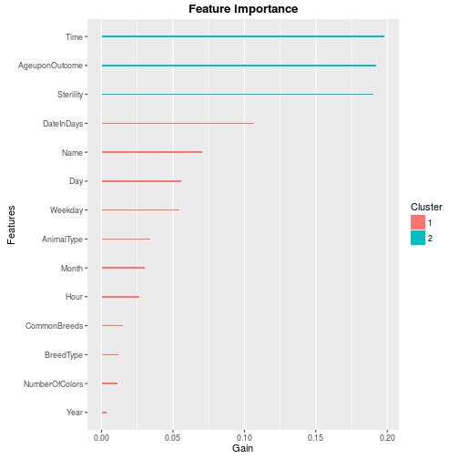
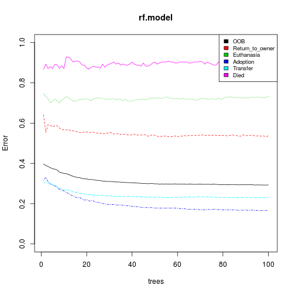

# Introduction
Every year, approximately 7.6 million companion animals end up in US shelters. Many animals are given up as unwanted by their owners, while others are picked up after getting lost or taken out of cruelty situations. Many of these animals find forever families to take them home, but just as many are not so lucky. 2.7 million dogs and cats are euthanized in the US every year.


## Objective
The objective is to help improving outcomes for shelter animals. Using a dataset of intake information including breed, color, sex, and age from the Austin Animal Center, we have to predict the outcome for each animal.

To support our analysis, we are given the train and test sets in CSV files. From this, we have written a code book to help understanding each feature and their values.


## Data Source
The data comes from [Austin Animal Center](http://www.austintexas.gov/department/animal-services) from October 1st, 2013 to March, 2016. Outcomes represent the status of animals as they leave the Animal Center. All animals receive a unique Animal ID during intake. Source of the competition: [Shelter Animal Outcomes](https://www.kaggle.com/c/shelter-animal-outcomes).


## Dataset Questions
Before we start the exploration of the dataset, we need to write a list of questions about this dataset considering the problem we have to solve. 

* How big is the dataset? (Described in the Code Book)
* Does the dataset contains `NA` or missing values? Can we replace them by a value? Why?
* Does the data is coherent (date with same format, no out of bound values, no misspelled words, etc.)?
* What does the data look like and what are the relationships between features if they exist?
* What are the measures used?
* Can we solve the problem with this dataset?

Questions on features:

* Are features in the dataset sufficiant to explain each outcome?
* What is the proportion of animals and how many cats and dogs are they for each outcome?
* Are there features that can be split in many other features? If yes, are they improving the score? Why and how?
* For each outcome, what features have the most importance and why?


## Evaluation Metrics
Since we have 5 outcome types where we need to calculate a prediction's probability for each class (outcome type), we have to manage 5 classes using a multi-class algorithm. The `Log Loss` function quantifies the accuracy of a classifier by penalising false classifications. Minimising the `Log Loss` function is basically equivalent to maximising the accuracy of the classifier which is what we need.

Thus, Kaggle provides us the evaluation metric we need:
$$LogLoss = -\frac{1}{N} \sum_{i = 0}^N \sum_{j = 0}^M y_{i,j} \log{\mathbb{P}_{i,j}}$$
where 
    $N$ is the total number of animals, 
    $M$ is the number of outcomes, 
    $y_{i,j}$ is 1 if observation $i$ is in outcome $j$ and 0 otherwise,
    $\mathbb{P}_{i,j}$ is the predicted probability that observation $i$ belongs to outcome $j$.


## Methodology
When we will evaluate a model, we will train it first with the training set. When our model will be chosen, we will test it with this model. We will also use cross-validation since we are limited with the data given.

Since the output to predict is known and well defined, we will use a supervised algorithm to solve the problem. This is a multi-class problem where we have to give a probability for each class. 

In this document, we start by exploring the dataset and build the data story behind it. This will give us important insights which will answer our questions on this dataset. The next step is to do some feature engineering which consists to create, remove or replace features regarding insights we got when exploring the dataset. We will ensure our new dataset is a valid input for our prediction model. After applying our model to the test set, we will visualize the predictions calculated and explain the results.


<!------------------------------------------------------------EXPLORATORY ANALYSIS------------------------------------------------------------------------------>


# Exploratory Analysis
In this section, we explore the dataset and we test hypotheses on features. The objective is to visualize and understand the relationships between features in the dataset we have to solve the problem. We will also compare changes we will make to this dataset to validate if they have significant influance on the outcomes or not.

We will also add and remove features from the dataset depending on the importance of insights we will find with data visualization. We will transform each feature in categories represented by a positive integer. The objective is to clean and prepare the dataset for our prediction's model and to answer the questions: `Are there features that can be split in many other features? If yes, are they improving the score? Why and how?`. Those questions will be answered throughout this section and with the data story presented at the conclusion of this document.

We will look at each feature of the dataset and split them if there are more information given than what the feature's name tells. For example, the feature `SexuponOutcome` tells us more than just the sex of the animal regarding the possible values. We can extract the sex and if the animal is sterile or not.

Each features having limited number of unique values (categories) will be numbered by a positive integer starting at 0. The zero-based ID will not hold for new features describing a number of elements (e.g. month or day number). Those ones will be one-base instead.

We first load the test and train datasets, and set the seed. Lets answer the question: `Does the dataset contains NA or missing values? Can we replace them by a value? Why?` All blank, space and unknown values are replaced by the value `0`. After writting the code book, we have seen that unique values in all features except the ID can be interpreted as Categories which can be grouped by another feature. In this way, the unknown, space or blank values can be treated as a Category ID as well. Thus, we decide to set their value to 0.


```r
source("Utilities.R")

strings.toNA <- c("", " ", "Unknown", "0 years")
train <- read.csv("train.csv", header = TRUE, na.strings = strings.toNA, stringsAsFactors = FALSE)
test <- read.csv("test.csv", header = TRUE, na.strings = strings.toNA, stringsAsFactors = FALSE)

set.seed(1234)

## Remove scientific notation (e.g. E-005).
options(scipen = 999)

## Remove the AnimalID which are not needed for the analysis.
train$AnimalID <- NULL
test.id <- test$ID
test$ID <- NULL

train[is.na(train)] <- 0
test[is.na(test)] <- 0

## Samples and population sizes.
train.n <- nrow(train)
test.n <- nrow(test)
N <- train.n + test.n
```

Since the number of possible values for each feature is generally greater than 4 or 5, we will use bar charts to visualize our analysis of the dataset.

We also know that the population is $N = 38185$ animals. The samples are $n_{test} = 11456$ animals which is 30.0013094 % of the population and $n_{train} = 26729$ animals the other 69.9986906% of the population.


## Data Coherence
We answer the question: `Does the data is coherent (date with same format, no out of bound values, no misspelled words, etc.)?` Most of features are coherent, but we found some incoherence in the `AgeuponOutcome` feature. Incoherent values found are `0 years` which is impossible because age cannot be 0. Also, a grammar error on the value `1 weeks` which does not take a 's'. Since there is a value `1 week` which is correctly written, we need to find (with `grep`) values containing the string "week". This will automatically give both, weeks and week.


## Outcomes Visualization
The objective is to answer the question: `What is the proportion of animals and how many cats and dogs are they for each outcome?`. Let's visualize how the outcomes are split in the train set with the following histogram.


This bar chart shows that adoptions and transfers are mostly occuring. Now, we need to know how many cats and dogs are they for each outcome.



We can see from this bar chart that dogs are returned to their owner almost 8 times (16% for dogs against 1.9% for cats) more than cats. Cats are mostly transferred and dogs are mostly returned to the owner with significant difference. The percentage for the other outcomes are slightly the same.

We replace the possible values of the AnimalType feature by 0 = Dog and 1 = Cat.


```r
train.copy <- train

animal.types <- unique(c(train$AnimalType, test$AnimalType))
train$AnimalType <- GetIntegerFeatureFromGroups(train$AnimalType, animal.types) - 1
    #as.integer(mapvalues(train$AnimalType, from = animal.types, to = seq(0, length(animal.types) - 1)))
test$AnimalType <- GetIntegerFeatureFromGroups(test$AnimalType, animal.types) - 1
    #as.integer(mapvalues(test$AnimalType, from = animal.types, to = seq(0, length(animal.types) - 1)))
```


## Animal's Age
The age of animals should be an important factor on outcomes. People want to adopt a young animal (between 1 month and 1 year old) because they can raise the animal more easily and keep it longer. Older animals (Over 1 year old) may have more difficulty to respond to their new master. Baby animals may be subject to a transfer for experimentations or for clinical reasons. Adopting a baby animal (less than a month old) needs more attention from the owner. Thus, adoptions should not be frequent for them. We show a bar chart of ages of animals.



We can see that between 1 day and 4 weeks old, animals are mostly transferred including unknowns identified by 0. Animals are mostly adopted between 1 month and 1 years old. Between 1 year and 10 years old, animal adoptions decrease while age increases. Finally, animals are euthanasied or returned to their owner specially between 11 years and 20 years old.

We transform the feature `AgeuponOutcome` to integer values. For example, the age should be counted in days. Thus, `2 years` is replaced by the value 2 * 365 = 730. For months, the formula is `age * 30`. For weeks, the formula is `age * 7`. For years, the formula is `age * 365`.


```r
## Get the list of integers extracted from the feature AgeuponOutcome.
train.age <- as.integer(regmatches(train$AgeuponOutcome, regexpr("[[:digit:]]+", train$AgeuponOutcome)))
test.age <- as.integer(regmatches(test$AgeuponOutcome, regexpr("[[:digit:]]+", test$AgeuponOutcome)))

## Get row index list where AgeuponOutcome contains "year", "month", "week" or "day".
## Get the correspondant integer from each row index and apply the formula to get all ages in days.
train.year.list <- grep("year", train$AgeuponOutcome)
train$AgeuponOutcome[train.year.list] <- train.age[train.year.list] * 365
train.month.list <- grep("month", train$AgeuponOutcome)
train$AgeuponOutcome[train.month.list] <- train.age[train.month.list] * 30
train.week.list <- grep("week", train$AgeuponOutcome)
train$AgeuponOutcome[train.week.list] <- train.age[train.week.list] * 7
train.day.list <- grep("day", train$AgeuponOutcome)
train$AgeuponOutcome[train.day.list] <- train.age[train.day.list]

test.year.list <- grep("year", test$AgeuponOutcome)
test$AgeuponOutcome[test.year.list] <- test.age[test.year.list] * 365
test.month.list <- grep("month", test$AgeuponOutcome)
test$AgeuponOutcome[test.month.list] <- test.age[test.month.list] * 30
test.week.list <- grep("week", test$AgeuponOutcome)
test$AgeuponOutcome[test.week.list] <- test.age[test.week.list] * 7
test.day.list <- grep("day", test$AgeuponOutcome)
test$AgeuponOutcome[test.day.list] <- test.age[test.day.list]

train$AgeuponOutcome <- as.integer(train$AgeuponOutcome)
test$AgeuponOutcome <- as.integer(test$AgeuponOutcome)
```


## Animal's Name
The feature `Name` is transformed to a boolean value where the value is 0 when the animal has no name or his length is 1, and 1 otherwise. Logically, the name of an animal should not have any impact on the outcomes. But knowing that an animal has no name versus has a name may influance the outcomes. 



From the bar chart, we can see that the name length follow the normal distribution if we exclude length of 0. Animals having no name are mostly transfered but for cats, this is very significant. Transferred cats having no name represent 0 % of the train set and 35.2501029 % of all the transferred animals of the train set. This is clearly an insight to consider. Therefore, we transform string values of the `Name` feature in boolean values telling if the animal has a name = 1 or has no name = 0.


```r
train$Name[train$Name != 0] <- 1
test$Name[test$Name != 0] <- 1
```


## Animal's Sterility and Sex
We want to see if extracting information that check if the animal is sterile or not will have influance on the outcomes. Generally, people who want to adopt a dog or a cat want to know if the animal is sterile or intact. Let's see if this is true with our dataset.


We can see that sterile animals are mostly adopted which confirms our hypothesis. Unknown or intact animals are mostly transferred. This makes sense with unknown ones since they may need to be transferred to the clinic to identify clearly their sex and if they are sterile or not. Note that animals that we do not know if they are sterile or not (Unknown) are not adopted. Thus, knowing if the animal is sterile or not has influance on the outcomes.

From this bar chart, we distinguish 3 groups: Unknown, Intact (not neutered or not spayed), Sterile (neutered or spayed).

We replace the feature `SexuponOutcome` by `Sterility` where Unknown = 0, Intact = 1 and Sterile = 2. Since there is no significant difference between sexes, we won't create a feature Sex.


```r
train$Sterility <- 0
train$Sterility[grep("Intact", train$SexuponOutcome)] <- 1
train$Sterility[grep("Spayed|Neutered", train$SexuponOutcome)] <- 2

test$Sterility <- 0
test$Sterility[grep("Intact", test$SexuponOutcome)] <- 1
test$Sterility[grep("Spayed|Neutered", test$SexuponOutcome)] <- 2

train$SexuponOutcome <- NULL
test$SexuponOutcome <- NULL
```


## Date & Time
The date and time may have a big influance on the outcomes. We have seen that adoptions represent the most popular outcome of the dataset. Our hypothesis is that people will mostly adopt an animal the weekend.


From the bar chart, we can see that animals are mostly adopted the weekend (Saturday and Sunday) which confirm our hypothesis. This makes sense since most of people are working from Monday to Friday. Looking at the website [Austin Animal Center](http://www.austintexas.gov/department/animal-services), animal receiving are only from 11am - 5pm the weekend and 11am - 7pm the other days. From these information, we suppose that extracting the hour from the `DateTime` feature could have influance on the outcomes.


From the bar chart, we see that adoptions and returns to owner occur at 5pm and 6pm. Generally, people finish working around 4:30pm - 5pm so this makes sense. There are no outcomes done between 1am and 4am inclusively. There are transfers done at midnight, and at 9am for cats mostly, but most of them are done between 11am and 7pm which correspond to the open hours of the center. Adoptions and transfers done out of open hours may be for exceptional circumstances.


Looking at minutes seems useless since 1 minute is very short and most of us will look at the hour only except if the software records also the minutes and even the seconds. But, from this bar chart, we can see that at 0 minute, there are a lot of transfers done compared to other minutes. From 1 to 59 minutes, the difference is negligible (approximately uniform as expected). This could be explained by an automatic setting if the user does not enter the minutes when recording a new outcome with the software. The software convert empty minutes by "00" as well as the seconds. Since this is recurrent for transfers at 9:00am, it could be the same employee that records these transfers. This is also the case if the user enters only the date. The hours may be set automatically to 00:00:00.

Looking at the days, we should see more adoptions the weekend since the majority of people are not working.


There are 4 days (12, 13, 18, 19) where the number of animals and adoptions are higher than the other days for cats. Also, note that there are less animals on the day 31. Indeed, since there are only 7 months over 12 having 31 days, this result makes sense.

We look now at the months to check if some of them can reveal important insights.


From the bar chart, we can see that December and January are months having highest number of adoptions of dogs. for the cats, July and December represent the highest number of adoptions. This can be explained by holidays like Christmas and the New Year's day. One possible hypothesis is that children want a dog or a cat for Christmas so they ask their parents to adopt an animal and give them as a Christmas gift.


Years 2013 and 2016 have less outcomes than 2014 and 2015 since the dataset dates start on 2013-10-01 09:31:00 and end on 2016-02-21 19:17:00.

We did not mention the seconds since there is 0 animal where the seconds are different to 0.

From the feature `DateTime` of the dataset, we extract many useful features. Those features are transformed to positive integers. The features we extract are the following:

* Day: integer from 1 to 31 depending on the month
* Month: integer from 1 to 12
* Year: integer from 2013 to 2016
* Hour: integer from 0 to 23
* Weekday: integer from 0 to 6 which represent Sunday to Saturday
* DateInDays: Number of days from the oldest date of the dataset
* Time: The time represented by the equation $60h + m$ where $h$ is the hours and $m$ the minutes.


```r
train$Weekday <- as.POSIXlt(train$DateTime)$wday
test$Weekday <- as.POSIXlt(test$DateTime)$wday

train.date <- ymd_hms(train$DateTime)
test.date <- ymd_hms(test$DateTime)
#years <- unique(c(year(train.date), year(test.date)))

## The year starts at 0 which is the minimum year of the dataset.
train$Year <- year(train.date)
train$Month <- month(train.date)
train$Day <- day(train.date)
train$DateInDays <- difftime(as.Date(train.date,'%Y/%m/%d'), as.Date(min(train.date),'%Y/%m/%d'), units = c("days"))
train$Time <- hour(train.date) * 60 + minute(train.date)

test$Year <- year(test.date)
test$Month <- month(test.date)
test$Day <- day(test.date)
test$DateInDays <- difftime(as.Date(test.date,'%Y/%m/%d'), as.Date(min(test.date),'%Y/%m/%d'), units = c("days"))
test$Time <- hour(test.date) * 60 + minute(test.date)

train$DateTime <- NULL
test$DateTime <- NULL
```


## Animal's Breed
Since we have many breeds, we will create a breed class named 'Other' where breeds having less than 100 animals will be in this class. The breed should be important since people do not want to adopt an agressive animal for example. 



For the dogs, Shih Tzu are mostly transferred and less adopted. Pit bulls, Labrador Retreiver and Chihuahua Shorthair are the most common dogs for outcomes. For cats, the domestic shorthair is the most frequent and represent NaN % of the cats in the train set.

Lets summarize the number of adopted animals and their percentage grouped by the breed. In this way, we will see which animals have the lowest ratio for adoption.


```
## Source: local data frame [37 x 4]
## Groups: Breed1 [37]
## 
##                Breed1 OutcomeType Total Percentage
##                 (chr)       (chr) (int)      (dbl)
## 1            Shih Tzu    Adoption    19  0.1079545
## 2                 Pug    Adoption    31  0.2792793
## 3            Pit Bull    Adoption   625  0.2957880
## 4          Rottweiler    Adoption    59  0.3259669
## 5    American Bulldog    Adoption    45  0.3461538
## 6      Siberian Husky    Adoption    68  0.3505155
## 7    Golden Retriever    Adoption    39  0.3644860
## 8      Great Pyrenees    Adoption    48  0.3664122
## 9  Domestic Shorthair    Adoption  3328  0.3715115
## 10  Domestic Longhair    Adoption   217  0.3967093
## ..                ...         ...   ...        ...
```


From the bar chart and summary, we see that Shih Tzu, Pug, Pit Bull are breeds with lowest percentage of adoption.

We also check if the breed types (Mix, Cross or Pure) have a significant impact on the outcomes.


We extract this information from the `Breed` feature and add a new feature `BreedType` where all purebred animals are identified with the value 2 per the code book. The mixed breed are identified with the value 0 and crossed breed with value 1.


```r
train$BreedType <- 2
train$BreedType[train.breed.cross.list] <- 1
train$BreedType[train.breed.mix.list] <- 0

test.breed.mix.list <- grep(" Mix", test$Breed)
test.breed.cross.list <- grep("/", test$Breed)
test$BreedType <- 2
test$BreedType[test.breed.cross.list] <- 1
test$BreedType[test.breed.mix.list] <- 0
```


```r
breeds <- c("Pit Bull", "Shih Tzu", "Pug")
train$CommonBreeds <- GetIntegerFeatureFromGroups(train$Breed, breeds) - 1
test$CommonBreeds <- GetIntegerFeatureFromGroups(test$Breed, breeds) - 1

## New feature 'HairType' where Shorthair = 0, Longhair = 1, Wirehair = 2, Medium Hair = 3
#hair.type <- c("Shorthair", "Longhair", "Wirehair", "Medium Hair")
#train$HairType <- as.integer(mapvalues(train$Breed, from = hair.type, to = seq(0, length(hair.type) - 1)))
#test$HairType <- as.integer(mapvalues(test$Breed, from = hair.type, to = seq(0, length(hair.type) - 1)))
#train$HairType <- GetIntegerFeatureFromGroups(train$Breed, hair.type) - 1
#test$HairType <- GetIntegerFeatureFromGroups(test$Breed, hair.type) - 1

# train$IsShorthair <- GetBooleanFeatureFromGroup(train$Breed, "Shorthair")
# test$IsShorthair <- GetBooleanFeatureFromGroup(test$Breed, "Shorthair")
# 
# ## New feature 'IsDomestic' where Domestic = 1 otherwise = 0
# train$IsDomestic <- GetBooleanFeatureFromGroup(train$Breed, "Domestic")
# test$IsDomestic <- GetBooleanFeatureFromGroup(test$Breed, "Domestic")
# 
# ## New feature 'IsMiniature' where Miniature = 1 otherwise = 0
# train$IsMiniature <- GetBooleanFeatureFromGroup(train$Breed, "Miniature")
# test$IsMiniature <- GetBooleanFeatureFromGroup(test$Breed, "Miniature")
# 
# ## New feature 'IsPitbull' where Pit Bull = 1 otherwise = 0
# train$IsPitbull <- GetBooleanFeatureFromGroup(train$Breed, "Pit Bull")
# test$IsPitbull <- GetBooleanFeatureFromGroup(test$Breed, "Pit Bull")
# 
# ## New feature 'IsShihTzu' where Shih Tzu = 1 otherwise = 0
# train$IsShihTzu <- GetBooleanFeatureFromGroup(train$Breed, "Shih Tzu")
# test$IsShihTzu <- GetBooleanFeatureFromGroup(test$Breed, "Shih Tzu")
# 
# train$IsLabrador <- GetBooleanFeatureFromGroup(train$Breed, "Labrador Retriever")
# test$IsLabrador <- GetBooleanFeatureFromGroup(test$Breed, "Labrador Retriever")

train$Breed <- NULL
test$Breed <- NULL
```


## Animal's Color
For each outcome type, we want to know which animal's color has the greatest and lowest count. For colors having less than 100 animals, we categorize them as `Others` meaning that these colors are not common.


For the cats, we can see that tan cats are always adopted and tricolor cats are always transferred. Another important insight is that brown cats have not died, are not euthanasied or are not returned to their owner. However, the number of cats for of those colors is not big. Black color is the most popular for cats and dogs following this bar chart.

Some of colors have a qualifier but these should not have big influance on the outcomes. We take the feature `Color1` to determine the qualifiers and see what happens.


We can verify with the bar chart above shows that qualifiers has no significant influance on the outcomes for dogs. For cats, tabby is frequent.

With the color feature, we can extract the number of colors. If we find a slash `/` character which we define as a `separator`, then we have 2 colors. If we find `Tricolor`, then this means that we have 3 colors. 


```r
train$NumberOfColors <- train.copy$NumberOfColors

test$NumberOfColors <- str_count(test$Color, "/") + 1
test$NumberOfColors[grep("Tricolor", test$Color)] <- 3
```

<!--As we have seen previously, we know that if there is a separator, then we have 2 colors. Thus, we can split the feature `Color` in 2 features: `Color1` and `Color2`. To get `Color1`, we will take all strings without the separator or the left side of the string if a separator is found. For `Color2`, we will take the right side of all strings containing the separator. Those features will be converted as a positive integer where each represents a specific color. `Color2` is 0 if and only if there is no separator.


```r
# train.colors <- unique(c(gsub(".*/", "", train$Color), gsub("/.*", "", train$Color)))
# train.colors.list <- unique(gsub(" .*$", "", train.colors))
# indices <- grep("/", train$Color)
# 
# train.color1 <- gsub("/.*", "", train$Color)
# train$Color1 <- GetIntegerFeatureFromGroups(train.color1, train.colors.list)
# 
# train.color2 <- rep("", length(train$Color))
# train.color2[indices] <- gsub(".*/", "", train$Color[indices])
# train$Color2 <- GetIntegerFeatureFromGroups(train.color2, train.colors.list)
# 
# 
# test.colors <- unique(c(gsub(".*/", "", test$Color), gsub("/.*", "", test$Color)))
# test.colors.list <- unique(gsub(" .*$", "", test.colors))
# indices <- grep("/", test$Color)
# 
# test.color1 <- gsub("/.*", "", test$Color)
# test$Color1 <- GetIntegerFeatureFromGroups(test.color1, test.colors.list)
# 
# test.color2 <- rep("", length(test$Color))
# test.color2[indices] <- gsub(".*/", "", test$Color[indices])
# test$Color2 <- GetIntegerFeatureFromGroups(test.color2, test.colors.list)
```

From the bar plots shown for animals color, we add binary features for the following colors (Tan, Tricolor, Brown, Buff, Yellow, Sable). They are special cases where colors have a high or low percentage of outcomes.


```r
## Cats
#colors <- c("Tan", "Tricolor", "Brown", "Buff")
#train$Color <- GetIntegerFeatureFromGroups(train$Color, colors) - 1
#test$Color <- GetIntegerFeatureFromGroups(test$Color, colors) - 1

# train$IsTan <- ifelse(train$Color == "Tan" & train$AnimalType == 1, 1, 0)
# test$IsTan <- ifelse(test$Color == "Tan" & test$AnimalType == 1, 1, 0)
# 
# train$IsTricolor <- ifelse(train$Color == "Tricolor" & train$AnimalType == 1, 1, 0)
# test$IsTricolor <- ifelse(test$Color == "Tricolor" & test$AnimalType == 1, 1, 0)
# 
# train$IsBrown <- ifelse(train$Color == "Brown" & train$AnimalType == 1, 1, 0)
# test$IsBrown <- ifelse(test$Color == "Brown" & test$AnimalType == 1, 1, 0)
# 
# train$IsBuff <- ifelse(train$Color == "Buff" & train$AnimalType == 1, 1, 0)
# test$IsBuff <- ifelse(test$Color == "Buff" & test$AnimalType == 1, 1, 0)
# 
# ## Dogs
# train$IsYellow <- ifelse(train$Color == "Yellow" & train$AnimalType == 0, 1, 0)
# test$IsYellow <- ifelse(test$Color == "Yellow" & test$AnimalType == 0, 1, 0)
# 
# train$IsSable <- ifelse(train$Color == "Sable" & train$AnimalType == 0, 1, 0)
# test$IsSable <- ifelse(test$Color == "Sable" & test$AnimalType == 0, 1, 0)
# 
#train$IsBlack <- ifelse(train$Color == "Black", 1, 0)
#test$IsBlack <- ifelse(test$Color == "Black", 1, 0)
# 
# train$IsTabby <- ifelse(grepl("Tabby", train$Color), 1, 0)
# test$IsTabby <- ifelse(grepl("Tabby", test$Color), 1, 0)

train$Color <- NULL
test$Color <- NULL
```
-->


<!----------------------------------------------------------------------TRAINING MODEL--------------------------------------------------------------------------->


# Training Model
In this section, we present what algorithm is used, why are we using it and how it is used. The objective is to build the final submission file containing the probabilities for each outcome type of each animal given in the test set. 

Extreme Gradient Boosting Trees is a good choice to modelize our data. Each tree is a decision tree representing a group of animals where the probabilities of each outcome are approximately the same. For example, first level could be if the animal is sterile, intact or unknown. The second level could be if an animal has a name or not.  


## Fine Tuning Parameters
We prepare the parameters and matrices for the cross-validation and final prediction. Since we need to get the probabilities for each class, then the objective used is `multi:softprob`. This metric requires the number of classes `num_class` to predict which is 5 in our case. We have found that the evaluation metric used is the multi-class log loss function which is `mlogloss` for the `XGBoost` algorithm.

We use the `subsample` parameter which is the subsample ratio of the training instances. The parameter `eta` control the learning rate since the XGBoost uses the gradient descent which needs a learning rate parameter.


```r
outcomes.string <- sort(unique(train$OutcomeType))
outcome.type <- CategoryToInteger(train$OutcomeType) - 1
#as.integer(mapvalues(train$OutcomeType, from = outcomes.string, to = seq(0, length(outcomes.string) - 1)))
indices <- order(unique(train$OutcomeType))

train$OutcomeSubtype <- NULL
train$OutcomeType <- NULL

outcome.class.num <- length(outcomes.string)
param <- list(objective        = "multi:softprob",
              num_class        = outcome.class.num,    
              eta              = 0.15,      # Control the learning rate
              subsample        = 0.8,
              max_depth        = 8,        # Maximum depth of the tree
              colsample_bytree = 0.9,     # Subsample ratio of columns when constructing each tree
              eval_metric      = "mlogloss")
```


## Cross-Validation
We proceed to a 10-fold cross-validation to get the optimal number of trees and multi-class log-loss score. We use randomly subsamples representing 75% of the training set. Since we don't have too many observations (animals) and features, we can use 10 folds instead of 5 folds. Thus, the training set will be split in 10 test samples where each test sample has 2672.9 observations.

For each tree, we will have the average of 10 error estimates to obtain a more robust estimate of the true prediction error. This is done for all trees and we get the optimal number of trees to use for the test set.

We also display 2 curves indicating the test and train multi-Logloss mean progression. The vertical dotted line is the optimal number of trees. This plot shows if the model overfit or underfit.



```
##      train.mlogloss.mean train.mlogloss.std test.mlogloss.mean
##   1:            1.445606           0.006627           1.452851
##   2:            1.323763           0.010100           1.337157
##   3:            1.225297           0.009931           1.244830
##   4:            1.145147           0.009201           1.170287
##   5:            1.078355           0.008393           1.108976
##  ---                                                          
## 226:            0.224460           0.002498           0.734191
## 227:            0.223530           0.002466           0.734414
## 228:            0.222557           0.002429           0.734792
## 229:            0.221623           0.002432           0.734985
## 230:            0.220613           0.002405           0.735238
##      test.mlogloss.std names
##   1:          0.006998     1
##   2:          0.011214     2
##   3:          0.011855     3
##   4:          0.012830     4
##   5:          0.012689     5
##  ---                        
## 226:          0.018677   226
## 227:          0.018658   227
## 228:          0.018806   228
## 229:          0.018825   229
## 230:          0.018946   230
```

```
## 
## Optimal testing set Log-Loss score: 0.71151
```

```
## 
## Associated training set Log-Loss score: 0.407947
```

```
## 
## Interval testing set Log-Loss score: [ 0.695218 ,  0.727802 ].
```

```
## 
## Difference between optimal training and testing sets Log-Loss: -0.303563
```

```
## 
## Optimal number of trees: 100
```


## Prediction
We proceed to the predictions of the test set and show the features importance.


```
##            Feature        Gain       Cover  Frequence
##  1:           Time 0.210782117 0.283547343 0.25857959
##  2:      Sterility 0.208588164 0.057716174 0.01914564
##  3: AgeuponOutcome 0.193822465 0.162751733 0.12003859
##  4:     DateInDays 0.109525121 0.225662584 0.19327254
##  5:           Name 0.057803403 0.033520009 0.01753755
##  6:            Day 0.055949897 0.072691419 0.12580877
##  7:        Weekday 0.054672408 0.049137660 0.09542548
##  8:     AnimalType 0.035496911 0.024913902 0.02281585
##  9:          Month 0.030414556 0.028569667 0.06532597
## 10:   CommonBreeds 0.016228447 0.027596982 0.02060237
## 11:      BreedType 0.011819463 0.019035219 0.02340232
## 12: NumberOfColors 0.010981692 0.012826227 0.02796171
## 13:           Year 0.003915356 0.002031082 0.01008362
```



Note that normally, we would have used a threshold to identify each animal associated to an outcome. Since this is a Kaggle competition, it is not required.


## Multi-class Log-Loss
We can verify how our predictions score under the multi-class log-loss function. We take our predictions applied to the train set and we compare to the real `OutcomeType` values of the train set.


```
## [1] 0.4228592
```


## Submission
We write the `ID` and the predicted outcome classes in the submission file.


```r
prediction.test <- data.frame(matrix(prediction.test, ncol = outcome.class.num, byrow = TRUE))[, indices]
colnames(prediction.test) <- outcomes.string

#exploit.indices <- which(test$AnimalType == 1 & test$Name == 0 & test$Time %in% c(0, 540))
#prediction.test[exploit.indices, ] <- data.frame(0, 0, 0, 0, 1)

submission <- cbind(data.frame(ID = test.id), prediction.test)
write.csv(submission, "Submission.csv", row.names = FALSE)
```


<!---------------------------------------------------------------CONCLUSION------------------------------------------------------------------------------------>


# Recommandations
The objective is to understand trends in animal outcomes. These insights could help shelters focus their energy on specific animals who need a little extra help finding a new home. Therefore, we need insights to help increasing the number of animals adopted.

An important insight we found in the dataset is if the animal is sterile, not sterile or unknown. 


The bar chart shows that animals with no information about its sterility are never adopted. They represent 4.0929328 % of the dataset where we already know the outcomes. Our predictions go the same way where the probabilities are very low as the following summary shows the results.


```
##       Min.    1st Qu.     Median       Mean    3rd Qu.       Max. 
## 0.00003934 0.00013770 0.00022610 0.00147500 0.00054940 0.10840000
```

Intact animals have a low percentage of adoptions. They represent 5.1307561 % of intact animals (which are 7036).


```
##      Min.   1st Qu.    Median      Mean   3rd Qu.      Max. 
## 0.0000752 0.0005052 0.0069970 0.0523500 0.0364900 0.9655000
```

Sterile animals show a better adoption ratio. They represent 55.9599978 % of sterile animals (which are 18599). This is an increase of 50.8292417 % compared to the intact ones.


```
##     Min.  1st Qu.   Median     Mean  3rd Qu.     Max. 
## 0.002281 0.324000 0.569400 0.571800 0.849900 0.999000
```

Since the adoption ratio is by far much better for sterile animals, we recommand to sterilize them when received to the Animal Center. This will greatly increase their chance to be adopted.

Regarding the open hours of the Animal Center which is between 11am and 7pm during the work days, we observed that there are more adoptions between 5pm and 7pm. Since people normally finish working between 4h30pm and 5h30pm, this result makes sense.


Therefore, we recommand to extend the open hours to allow people comming to the Animal Center after 7pm. 
