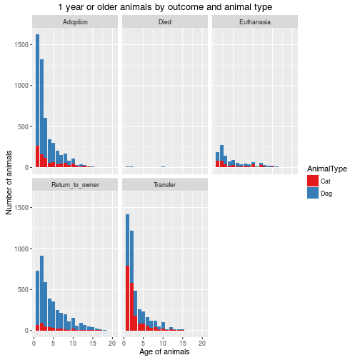
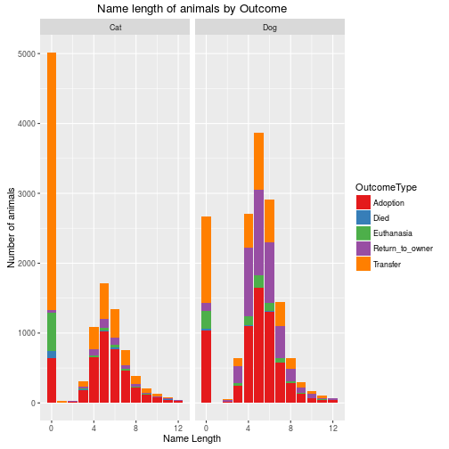
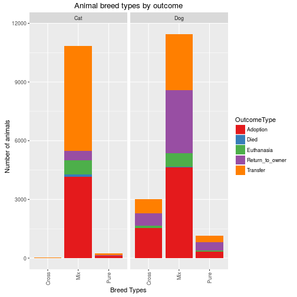

# 1 Introduction
Every year, approximately 7.6 million companion animals end up in US shelters. Many animals are given up as unwanted by their owners, while others are picked up after getting lost or taken out of cruelty situations. Many of these animals find forever families to take them home, but just as many are not so lucky. 2.7 million dogs and cats are euthanized in the US every year.


## 1.1 Objective
The objective is to help improving outcomes for shelter animals. Using a dataset of intake information including breed, color, sex, and age from the Austin Animal Center, we have to predict the outcome for each animal.

To support our analysis, we are given the train and test sets in CSV files.


## 1.2 Data Integrity
The data comes from [Austin Animal Center](http://www.austintexas.gov/department/animal-services) from October 1st, 2013 to March, 2016. Outcomes represent the status of animals as they leave the Animal Center. All animals receive a unique Animal ID during intake. Source of the competition: https://www.kaggle.com/c/shelter-animal-outcomes


## 1.3 Evaluation Metrics
Since we have 5 outcome types where we need to calculate a prediction's probability for each class (outcome type), we have to manage 5 classes using a multi-class algorithm. The `Log Loss` function quantifies the accuracy of a classifier by penalising false classifications. Minimising the `Log Loss` function is basically equivalent to maximising the accuracy of the classifier which is what we need.

Thus, Kaggle provides us the evaluation metric we need:
$$LogLoss = -\frac{1}{N} \sum_{i = 0}^N \sum_{j = 0}^M y_{ij} \log{\mathbb{P}_{ij}}$$
where 
    $N$ is the total number of animals, 
    $M$ is the number of outcomes, 
    $y_{ij}$ is 1 if observation $i$ is in outcome $j$ and 0 otherwise,
    $\mathbb{P}_{ij}$ is the predicted probability that observation $i$ belongs to outcome $j$.


## 1.4 Dataset Questions
Before we start the predictive analysis, we need to write a list of questions about this dataset considering what we have to predict. 

* What is the proportion of animals for each outcome?
* Are there features that can be split in many other features? If yes, are they improving the score? Why and how?
* For each outcome, what features have the most importance and why?


## 1.5 Questions that People can ask

* Does the animal have a name?
* Is the animal intact or spayed/neutered?
* Is the animal a male or female?
* How big is the animal?
* How old the animal is?
* Is the animal aggressive?
* How is the hair type of the animal? 
* Does the animal have any disease?
* Why is the owner got rid of the animal (if the animal belongs to a owner before)?


# 2 Exploration and Visualization
In this section, we explore the dataset and we test hypotheses on features. The objective is to visualize and compare changes we will make to this dataset to validate if they have significant influance on the outcomes or not.

We load the test and train datasets, and set the seed. All blank and space values are replaced by the value `0`.


```r
source("Utilities.R")

train <- read.csv("train.csv", header = TRUE, na.strings = c("", " "), stringsAsFactors = FALSE)
test <- read.csv("test.csv", header = TRUE, na.strings = c("", " "), stringsAsFactors = FALSE)
train[is.na(train)] <- 0
test[is.na(test)] <- 0
set.seed(1234)
```


### 2.1 Convert AgeuponOutcome Values to Days
We transform the feature `AgeuponOutcome` to integer values. The age will be counted in days. For example, `2 year` will be replaced by the value 2 * 365 = 730. For months, the formula will be `age * 30`. For weeks, the formula will be `age * 7`. Finally, for years, the formula will be `age * 365`.


```r
## Get the list of integer extracted from the feature AgeuponOutcome.
train.age <- as.integer(regmatches(train$AgeuponOutcome, regexpr("[[:digit:]]+", train$AgeuponOutcome)))
test.age <- as.integer(regmatches(test$AgeuponOutcome, regexpr("[[:digit:]]+", test$AgeuponOutcome)))

## Get row index list where AgeuponOutcome contains "year", "month", "week" or "day".
## Get the correspondant integer from each row index and apply the formula to get all ages in years.
train.year.list <- grep("year", train$AgeuponOutcome)
train$AgeuponOutcome[train.year.list] <- train.age[train.year.list] * 365
train.month.list <- grep("month", train$AgeuponOutcome)
train$AgeuponOutcome[train.month.list] <- train.age[train.month.list] * 30
train.week.list <- grep("week", train$AgeuponOutcome)
train$AgeuponOutcome[train.week.list] <- train.age[train.week.list] * 7
train.day.list <- grep("day", train$AgeuponOutcome)
train$AgeuponOutcome[train.day.list] <- train.age[train.day.list]

test.year.list <- grep("year", test$AgeuponOutcome)
test$AgeuponOutcome[test.year.list] <- test.age[test.year.list] * 365
test.month.list <- grep("month", test$AgeuponOutcome)
test$AgeuponOutcome[test.month.list] <- test.age[test.month.list] * 30
test.week.list <- grep("week", test$AgeuponOutcome)
test$AgeuponOutcome[test.week.list] <- test.age[test.week.list] * 7
test.day.list <- grep("day", test$AgeuponOutcome)
test$AgeuponOutcome[test.day.list] <- test.age[test.day.list]

train$AgeuponOutcome <- as.integer(train$AgeuponOutcome)
test$AgeuponOutcome <- as.integer(test$AgeuponOutcome)

print(summary(train$AgeuponOutcome))
```

```
##    Min. 1st Qu.  Median    Mean 3rd Qu.    Max. 
##     0.0    60.0   365.0   793.6  1095.0  7300.0
```


## 2.2 Outcomes Visualization
The objective is to answer the question: `What is the proportion of animals for each outcome?`. Let's visualize how the outcomes are split in the train set with the following histogram.


```r
ggplot(train, aes(OutcomeType)) +
        geom_bar(aes(y = ..count.. / sum(..count..))) +
        scale_y_continuous(labels = percent) +
        geom_text(aes(y = ..count.. / sum(..count..), label = scales::percent((..count..) / sum(..count..))), stat = "count", vjust = -0.25) +
        labs(title = "Percentage of each outcomes in the train set", y = "Percent", x = "Outcome Types")
```


### 2.3 Named vs No Named Animals
The feature `Name` is transformed to a boolean value where the value is 0 when the animal has no name, and 1 otherwise. Logically, the name of an animal should not have any impact on the outcomes. But knowing that an animal has no name versus has a name may influance the outcomes. 


```r
train$Name[train$Name != 0] <- 1
test$Name[test$Name != 0] <- 1

train$NameLength <- ifelse(train$Name == 0, 0, str_length(train$Name))
test$NameLength <- ifelse(test$Name == 0, 0, str_length(test$Name))
```

Let's take a look on the plot if this has a signifiant influance on the outcomes.


```r
train.named <- ddply(train, .(Name), summarise,
                     proportion = as.numeric(prop.table(table(OutcomeType))),
                     OutcomeType = names(table(OutcomeType)))
print(train.named)
```

```
##    Name  proportion     OutcomeType
## 1     0 0.218177090        Adoption
## 2     0 0.015602652            Died
## 3     0 0.105968015      Euthanasia
## 4     0 0.019893382 Return_to_owner
## 5     0 0.640358861        Transfer
## 6     1 0.477518647        Adoption
## 7     1 0.004044542            Died
## 8     1 0.038869629      Euthanasia
## 9     1 0.243355394 Return_to_owner
## 10    1 0.236211787        Transfer
```

```r
ggplot(train.named, aes(OutcomeType, proportion, fill = Name)) +
        geom_bar(stat = "identity", position = "dodge") +
        scale_y_continuous(labels = percent) +
        labs(title = "Outcome Percent by Animals Named vs. Not Named", y = "Percent", x = "Outcome Types Not Named vs Named")
```


Named animals are mostly adopted since no named animals are transfered from the above histogram. The feature telling if an animal has a name or not influances clearly the outcomes.


## 2.4 Impact of Age on Outcomes
We state that most important outcome will be different from a younger to an older animal. We define 'younger' animals all animals that are 1 month or younger, and 'older' animals being 1 year old and older.


```r
train.copy <- train
train.copy$AgeuponOutcome[train$AgeuponOutcome <= 30] <- "1 month and younger"
train.copy$AgeuponOutcome[train$AgeuponOutcome > 30 & train$AgeuponOutcome < 365] <- "Between 1 month and 1 year"
train.copy$AgeuponOutcome[train$AgeuponOutcome >= 365] <- "1 year and older"

train.age <- ddply(train.copy, .(AgeuponOutcome), summarise,
                   proportion = as.numeric(prop.table(table(OutcomeType))),
                   OutcomeType = names(table(OutcomeType)))
print(train.age)
```

```
##                AgeuponOutcome  proportion     OutcomeType
## 1         1 month and younger 0.124789207        Adoption
## 2         1 month and younger 0.028667791            Died
## 3         1 month and younger 0.058740866      Euthanasia
## 4         1 month and younger 0.011242271 Return_to_owner
## 5         1 month and younger 0.776559865        Transfer
## 6            1 year and older 0.339315836        Adoption
## 7            1 year and older 0.003913366            Died
## 8            1 year and older 0.079751704      Euthanasia
## 9            1 year and older 0.288307132 Return_to_owner
## 10           1 year and older 0.288711963        Transfer
## 11 Between 1 month and 1 year 0.634251497        Adoption
## 12 Between 1 month and 1 year 0.004431138            Died
## 13 Between 1 month and 1 year 0.019640719      Euthanasia
## 14 Between 1 month and 1 year 0.056646707 Return_to_owner
## 15 Between 1 month and 1 year 0.285029940        Transfer
```

```r
ggplot(train.age, aes(OutcomeType, proportion, fill = AgeuponOutcome)) +
        geom_bar(stat = "identity", position = "dodge") +
        scale_y_continuous(labels = percent) +
        labs(title = "Outcome Percent by Animals Age", y = "Percent", x = "Outcome Types group by ages")
```



We can see that older animals are mostly returned to the owner. The younger animals are transferred and the ones between 1 month and 1 year old are adopted. In conclusion, the age of animals has a significant influance on the outcomes. Therefore, creating groups of age like this will help.


## 2.5 Animal's Sterility
We want to see if extracting information that check if the animal is sterile or not will have influance on the outcomes. Generally, people who want to adopt a dog or a cat want to know if the animal is sterile or intact. Let's see if this is true with our dataset.


```r
train.copy$SexuponOutcome[grep("Intact", train$SexuponOutcome)] <- "Intact"
train.copy$SexuponOutcome[c(grep("Spayed", train$SexuponOutcome), grep("Neutered", train$SexuponOutcome))] <- "Sterile"
train.copy$SexuponOutcome[train$SexuponOutcome == 0] <- "Unknown"

train.sterile <- ddply(train.copy, .(SexuponOutcome), summarise,
                   proportion = as.numeric(prop.table(table(OutcomeType))),
                   OutcomeType = names(table(OutcomeType)))
print(train.sterile)
```

```
##    SexuponOutcome  proportion     OutcomeType
## 1          Intact 0.051307561        Adoption
## 2          Intact 0.019187038            Died
## 3          Intact 0.124786811      Euthanasia
## 4          Intact 0.110574190 Return_to_owner
## 5          Intact 0.694144400        Transfer
## 6         Sterile 0.559599978        Adoption
## 7         Sterile 0.001989354            Died
## 8         Sterile 0.030969407      Euthanasia
## 9         Sterile 0.214796494 Return_to_owner
## 10        Sterile 0.192644766        Transfer
## 11        Unknown 0.022851920            Died
## 12        Unknown 0.092321755      Euthanasia
## 13        Unknown 0.011882998 Return_to_owner
## 14        Unknown 0.872943327        Transfer
```

```r
ggplot(train.sterile, aes(OutcomeType, proportion, fill = SexuponOutcome)) +
        geom_bar(stat = "identity", position = "dodge") +
        scale_y_continuous(labels = percent) +
        labs(title = "Outcome Percent by Animals Sterility", y = "Percent", x = "Outcome Types group by Sterility")
```


We can see that sterile animals are mostly adopted which confirms our hypothesis. Unknown or intact animals are mostly transfered. Note that animals that we do not know if they are sterile or not (Unknown) are not adopted. Thus, knowing if the animal is sterile or not has influance on the outcomes.


## 2.6 Date & Time


```r
train.copy$WeekDay <- weekdays(as.Date(train$DateTime))

train.weekday <- ddply(train.copy, .(WeekDay), summarise,
                       proportion = as.numeric(prop.table(table(OutcomeType))),
                       OutcomeType = names(table(OutcomeType)))
print(train.weekday)
```

```
##      WeekDay  proportion     OutcomeType
## 1     Friday 0.348020078        Adoption
## 2     Friday 0.008644730            Died
## 3     Friday 0.065532627      Euthanasia
## 4     Friday 0.180702733 Return_to_owner
## 5     Friday 0.397099833        Transfer
## 6     Monday 0.366071429        Adoption
## 7     Monday 0.007305195            Died
## 8     Monday 0.069534632      Euthanasia
## 9     Monday 0.195346320 Return_to_owner
## 10    Monday 0.361742424        Transfer
## 11  Saturday 0.530818767        Adoption
## 12  Saturday 0.006669733            Died
## 13  Saturday 0.037488500      Euthanasia
## 14  Saturday 0.149954002 Return_to_owner
## 15  Saturday 0.275068997        Transfer
## 16    Sunday 0.513551077        Adoption
## 17    Sunday 0.007412555            Died
## 18    Sunday 0.040074126      Euthanasia
## 19    Sunday 0.161686356 Return_to_owner
## 20    Sunday 0.277275886        Transfer
## 21  Thursday 0.331457346        Adoption
## 22  Thursday 0.005924171            Died
## 23  Thursday 0.074052133      Euthanasia
## 24  Thursday 0.189869668 Return_to_owner
## 25  Thursday 0.398696682        Transfer
## 26   Tuesday 0.341375770        Adoption
## 27   Tuesday 0.008213552            Died
## 28   Tuesday 0.063141684      Euthanasia
## 29   Tuesday 0.188911704 Return_to_owner
## 30   Tuesday 0.398357290        Transfer
## 31 Wednesday 0.340170940        Adoption
## 32 Wednesday 0.007407407            Died
## 33 Wednesday 0.065811966      Euthanasia
## 34 Wednesday 0.196296296 Return_to_owner
## 35 Wednesday 0.390313390        Transfer
```

```r
ggplot(train.weekday, aes(OutcomeType, proportion, fill = WeekDay, width = 0.5)) +
        geom_bar(stat = "identity", position = "dodge") +
        scale_y_continuous(labels = percent) +
        labs(title = "Outcome Percent by Weekday", y = "Percent", x = "Outcome Types group by Weekday")
```



From the bar chart, we can see that animals are mostly adopted the weekend (Saturday and Sunday). This makes sense since most of people are working from Monday to Friday. Also, the weekend, there is less euthanasias, transfers and returns to owner. Looking at the website [Austin Animal Center](http://www.austintexas.gov/department/animal-services), animal receiving are only from 11am - 5pm the weekend and 11am - 7pm the other days. From these information, we suppose that extracting the hour from the `DateTime` feature could have influance on the outcomes.


```r
train.hours <- hour(ymd_hms(train$DateTime))
train.copy$OpenHours[train.hours >= 7 & train.hours < 21] <- "Day"
train.copy$OpenHours[train.hours < 7 | train.hours >= 21] <- "Night"

train.isnight <- ddply(train.copy, .(OpenHours), summarise,
                      proportion = as.numeric(prop.table(table(OutcomeType))),
                      OutcomeType = names(table(OutcomeType)))
print(train.isnight)
```

```
##    OpenHours  proportion     OutcomeType
## 1        Day 0.406944022        Adoption
## 2        Day 0.007263462            Died
## 3        Day 0.058982355      Euthanasia
## 4        Day 0.181092181 Return_to_owner
## 5        Day 0.345717980        Transfer
## 6      Night 0.157043880        Adoption
## 7      Night 0.013856813            Died
## 8      Night 0.009237875      Euthanasia
## 9      Night 0.055427252 Return_to_owner
## 10     Night 0.764434180        Transfer
```

```r
ggplot(train.isnight, aes(OutcomeType, proportion, fill = OpenHours)) +
        geom_bar(stat = "identity", position = "dodge") +
        scale_y_continuous(labels = percent) +
        labs(title = "Outcome Percent in function of Day or Night", y = "Percent", x = "Outcome Types group")
```


From the bar chart, transfers of animals are mostly done the night (between 9pm and 7am). Euthanasias, returns to owner and adoptions are mostly done during the day (between 7am and 9pm).


## 2.7 Convert Feature Values to Integers
The objective is to replace every unique feature's values by their corresponding integer. Features like `AnimalType` and `OutcomeType` are replaced by their corresponding `ID` as specified in the Code Book.


```r
train.animal.type <- ddply(train, .(AnimalType), summarise,
                           proportion = as.numeric(prop.table(table(OutcomeType))),
                           OutcomeType = names(table(OutcomeType)))
print(train.animal.type)
```

```
##    AnimalType  proportion     OutcomeType
## 1         Cat 0.383689599        Adoption
## 2         Cat 0.013202802            Died
## 3         Cat 0.063768637      Euthanasia
## 4         Cat 0.044907491 Return_to_owner
## 5         Cat 0.494431471        Transfer
## 6         Dog 0.416607887        Adoption
## 7         Dog 0.003206156            Died
## 8         Dog 0.054184033      Euthanasia
## 9         Dog 0.274831677 Return_to_owner
## 10        Dog 0.251170247        Transfer
```

```r
ggplot(train.animal.type, aes(OutcomeType, proportion, fill = AnimalType)) +
        geom_bar(stat = "identity", position = "dodge") +
        scale_y_continuous(labels = percent) +
        labs(title = "Outcome Percent by Animal Types", y = "Percent", x = "Outcome Types by Animal Types")
```


```r
train$AnimalType <- CategoryToInteger(train$AnimalType)
test$AnimalType <- CategoryToInteger(test$AnimalType)
```


# 3 Feature Engineering
In this section, we add and remove features from the dataset. We also transform each feature in categories represented by a positive integer. The objective is to clean and prepare the dataset for our prediction's model and to answer the questions: `Are there features that can be split in many other features? If yes, are they improving the score? Why and how?`. The answerr to those questions will be the conclusion of this section.


## 3.1 Removing Features
We remove the features `AnimalID`, `OutcomeSubtype` and `OutcomeType`.


```r
train$AnimalID <- NULL
test.id <- test$ID
test$ID <- NULL

train$OutcomeSubtype <- NULL
```


## 3.2 Adding Features
The objective is to look at each feature of the dataset and split them if there are more information given than what the feature's name tells. For example, the feature `SexuponOutcome` tells us more than just the sex of the animal regarding the possible values.


### 3.2.1 DateTime Feature
From the feature `DateTime` of the dataset, we extract the date and the time separately. We replace the `DateTime` feature by 2 new features named `Date` and `Time`. Those features are transformed to positive integers. Also, knowing the weekday 


```r
train$WeekDay <- as.POSIXlt(train$DateTime)$wday
test$WeekDay <- as.POSIXlt(test$DateTime)$wday

train.date <- ymd_hms(train$DateTime)
train.hours <- hour(train.date)
train$Date <- year(train.date) * 10000 + month(train.date) * 100 + day(train.date)
train$Time <- train.hours * 100 + minute(train.date)
train$OpenHours <- ifelse(train.hours >= 7 & train.hours < 21, 1, 0)

test.date <- ymd_hms(test$DateTime)
test.hours <- hour(test.date)
test$Date <- year(test.date) * 10000 + month(test.date) * 100 + day(test.date)
test$Time <- hour(test.date) * 100 + minute(test.date)
test$OpenHours <- ifelse(test.hours >= 7 & test.hours < 21, 1, 0)

train$DateTime <- NULL
test$DateTime <- NULL
```


### 3.2.2 Age by Categories
We have seen that age of animals separated in 3 categories has influance on outcomes.


```r
train$AgeGroup <- train$AgeuponOutcome
train$AgeGroup[train$AgeuponOutcome <= 30] <- 1
train$AgeGroup[train$AgeuponOutcome <= 365 & train$AgeuponOutcome > 30] <- 2
train$AgeGroup[train$AgeuponOutcome > 365] <- 3

test$AgeGroup <- test$AgeuponOutcome
test$AgeGroup[test$AgeuponOutcome <= 30] <- 1
test$AgeGroup[test$AgeuponOutcome <= 365 & test$AgeuponOutcome > 30] <- 2
test$AgeGroup[test$AgeuponOutcome > 365] <- 3

# train$LessThanMonth <- ifelse(train$AgeuponOutcome <= 480, 1, 0)
# test$LessThanMonth <- ifelse(test$AgeuponOutcome <= 480, 1, 0)
# 
# train$Upto1Years <- ifelse(train$AgeuponOutcome <= 2555 & train$AgeuponOutcome > 480, 1, 0)
# test$Upto1Years <- ifelse(test$AgeuponOutcome <= 2555 & test$AgeuponOutcome > 480, 1, 0)
# 
# train$MoreThan1Years <- ifelse(train$AgeuponOutcome >= 2555, 1, 0)
# test$MoreThan1Years <- ifelse(test$AgeuponOutcome >= 2555, 1, 0)
```


### 3.2.3 SexuponOutcome Feature
This feature contains information on the sex of the animal and if the animal is sterile or intact. Thus, we create two features named `Sex` and `IsIntact` that will replace the feature `SexuponOutcome`.


```r
train.sex.male.list <- grep("Male", train$SexuponOutcome)
train.sex.female.list <- grep("Female", train$SexuponOutcome)
train$Sex <- 0
train$Sex[train.sex.male.list] <- 1
train$Sex[train.sex.female.list] <- 2

test.sex.male.list <- grep("Male", test$SexuponOutcome)
test.sex.female.list <- grep("Female", test$SexuponOutcome)
test$Sex <- 0
test$Sex[test.sex.male.list] <- 1
test$Sex[test.sex.female.list] <- 2


train.sex.intact.list <- grep("Intact", train$SexuponOutcome)
train.sex.other.list <- c(grep("Spayed", train$SexuponOutcome), grep("Neutered", train$SexuponOutcome))
train$IsIntact <- 0
train$IsIntact[train.sex.intact.list] <- 1
train$IsIntact[train.sex.other.list] <- 2

test.sex.intact.list <- grep("Intact", test$SexuponOutcome)
test.sex.other.list <- c(grep("Spayed", test$SexuponOutcome), grep("Neutered", test$SexuponOutcome))
test$IsIntact <- 0
test$IsIntact[test.sex.intact.list] <- 1
test$IsIntact[test.sex.other.list] <- 2

train$SexuponOutcome <- NULL
test$SexuponOutcome <- NULL
```


### 3.2.4 Breed Feature
For each animal, we verify if it is a mixed breed, a purebred or a crossed breed. We extract this information from the `Breed` feature and add a new feature `BreedType` where all purebred animals are identified with the value 3 per the code book. The mixed breed are identified with the value 1 and crossed breed with value 2.


```r
train.breed.mix.list <- grep(" Mix", train$Breed)
train.breed.cross.list <- grep("/", train$Breed)
train$BreedType <- 3
train$BreedType[train.breed.cross.list] <- 2
train$BreedType[train.breed.mix.list] <- 1

test.breed.mix.list <- grep(" Mix", test$Breed)
test.breed.cross.list <- grep("/", test$Breed)
test$BreedType <- 3
test$BreedType[test.breed.cross.list] <- 2
test$BreedType[test.breed.mix.list] <- 1
```

We want to get all possible breeds from the dataset. To process that, we will remove the string `Mix` for mixed breed animals and we will separate breeds from the crossed breed animals. Those are identified by a slash character `/`.


```r
## New feature 'HairType' where Shorthair = 1, Longhair = 2, Wirehair = 3, Medium Hair = 4, otherwise = 0
hair.type <- c("Shorthair", "Longhair", "Wirehair", "Medium Hair")
train$HairType <- GetIntegerFeatureFromGroups(train$Breed, hair.type)
test$HairType <- GetIntegerFeatureFromGroups(test$Breed, hair.type)

## New feature 'IsDomestic' where Domestic = 1 otherwise = 0
train$IsDomestic <- GetBooleanFeatureFromGroup(train$Breed, "Domestic")
test$IsDomestic <- GetBooleanFeatureFromGroup(test$Breed, "Domestic")

## New feature 'IsMiniature' where Miniature = 1 otherwise = 0
train$IsMiniature <- GetBooleanFeatureFromGroup(train$Breed, "Miniature")
test$IsMiniature <- GetBooleanFeatureFromGroup(test$Breed, "Miniature")

## New feature 'IsPitbull' where Pit Bull = 1 otherwise = 0
train$IsPitbull <- GetBooleanFeatureFromGroup(train$Breed, "Pit Bull")
test$IsPitbull <- GetBooleanFeatureFromGroup(test$Breed, "Pit Bull")

## New feature 'BreedGroup' where Shepherd = 1, Terrier = 2, Pit Bull = 3, Hound = 4, Domestic = 5, Others = 0
#breed.group <- c("Shepherd", "Terrier", "Pit Bull", "Hound", "Domestic", "Others")
#train$BreedGroup <- GetIntegerFeatureFromGroups(train$Breed, breed.group)
#test$BreedGroup <- GetIntegerFeatureFromGroups(test$Breed, breed.group)

## New feature 'IsHound' where Hound = 1 otherwise = 0
#train$IsHound <- GetBooleanFeatureFromGroup(train$Breed, "Hound")
#test$IsHound <- GetBooleanFeatureFromGroup(test$Breed, "Hound")

## New feature 'IsLabrador' where Labrador Retriever = 1 otherwise = 0
#train$IsLabrador <- GetBooleanFeatureFromGroup(train$Breed, "Labrador")
#test$IsLabrador <- GetBooleanFeatureFromGroup(test$Breed, "Labrador")

## New feature 'IsChihuahua' where Chihuahua = 1 otherwise = 0
#train$IsChihuahua <- GetBooleanFeatureFromGroup(train$Breed, "Chihuahua")
#test$IsChihuahua <- GetBooleanFeatureFromGroup(test$Breed, "Chihuahua")

## New feature 'IsTerrier' where Terrier = 1 otherwise = 0
#train$IsTerrier <- GetBooleanFeatureFromGroup(train$Breed, "Terrier")
#test$IsTerrier <- GetBooleanFeatureFromGroup(test$Breed, "Terrier")

#train$IsShepherd <- GetBooleanFeatureFromGroup(train$Breed, "Shepherd")
#test$IsShepherd <- GetBooleanFeatureFromGroup(test$Breed, "Shepherd")

train$Breed <- NULL
test$Breed <- NULL
```


### 3.2.5 Colors
With the color feature, we can extract the number of colors. If we find a slash `/` character which we define as a `separator`, then we have 2 colors. If we find `Tricolor`, then this means that we have 3 colors. 


```r
train.tricolor <- grep("Tricolor", train$Color)
train$NumberOfColors <- str_count(train$Color, "/") + 1
train$NumberOfColors[train.tricolor] <- 3

test.tricolor <- grep("Tricolor", test$Color)
test$NumberOfColors <- str_count(test$Color, "/") + 1
test$NumberOfColors[test.tricolor] <- 3
```

As we have seen previously, we know that if there is a separator, then we have 2 colors. Thus, we can split the feature `Color` in 2 features: `Color1` and `Color2`. To get `Color1`, we will take all strings without the separator or the left side of the string if a separator is found. For `Color2`, we will take the right side of all strings containing the separator. Those features will be converted as a positive integer where each represents a specific color. `Color2` is 0 if and only if there is no separator.


```r
train.colors <- unique(c(gsub(".*/", "", train$Color), gsub("/.*", "", train$Color)))
train.colors.list <- unique(gsub(" .*$", "", train.colors))
indices <- grep("/", train$Color)

train.color1 <- gsub("/.*", "", train$Color)
train$Color1 <- GetIntegerFeatureFromGroups(train.color1, train.colors.list)

train.color2 <- rep("", length(train$Color))
train.color2[indices] <- gsub(".*/", "", train$Color[indices])
train$Color2 <- GetIntegerFeatureFromGroups(train.color2, train.colors.list)


test.colors <- unique(c(gsub(".*/", "", test$Color), gsub("/.*", "", test$Color)))
test.colors.list <- unique(gsub(" .*$", "", test.colors))
indices <- grep("/", test$Color)

test.color1 <- gsub("/.*", "", test$Color)
test$Color1 <- GetIntegerFeatureFromGroups(test.color1, test.colors.list)

test.color2 <- rep("", length(test$Color))
test.color2[indices] <- gsub(".*/", "", test$Color[indices])
test$Color2 <- GetIntegerFeatureFromGroups(test.color2, test.colors.list)

train$Color <- NULL
test$Color <- NULL
```

We can extract qualifier of colors for every color containing a space character which we define as our qualifier separator. This new feature will be named `ColorQualifier` and will be 0 if there is no qualifier.


```r
colors.indices <- grep(" ", train.colors)
train.qualifiers <- unique(gsub(".* ", "", train.colors[colors.indices]))

indices <- grep(" ", train.color1)
train$ColorQualifier1 <- rep("", length(train.color1))
train$ColorQualifier1[indices] <- gsub(".* ", "", train.color1[indices])
train$ColorQualifier1 <- GetIntegerFeatureFromGroups(train$ColorQualifier1, train.qualifiers)

indices <- grep(" ", train.color2)
train$ColorQualifier2 <- rep("", length(train.color2))
train$ColorQualifier2[indices] <- gsub(".* ", "", train.color2[indices])
train$ColorQualifier2 <- GetIntegerFeatureFromGroups(train$ColorQualifier2, train.qualifiers)


colors.indices <- grep(" ", test.colors)
test.qualifiers <- unique(gsub(".* ", "", test.colors[colors.indices]))

indices <- grep(" ", test.color1)
test$ColorQualifier1 <- rep("", length(test.color1))
test$ColorQualifier1[indices] <- gsub(".* ", "", test.color1[indices])
test$ColorQualifier1 <- GetIntegerFeatureFromGroups(test$ColorQualifier1, test.qualifiers)

indices <- grep(" ", test.color2)
test$ColorQualifier2 <- rep("", length(test.color2))
test$ColorQualifier2[indices] <- gsub(".* ", "", test.color2[indices])
test$ColorQualifier2 <- GetIntegerFeatureFromGroups(test$ColorQualifier2, test.qualifiers)
```


# 4 Training Model
In this section, we present what algorithm is used, why are we using it and how it is used. The objective is to build the final submission file containing the probabilities for each outcome type of each animal given in the test set. 


## 4.1 Fine Tuning Parameters
We prepare the parameters and matrices for the cross-validation and final prediction. Since we need to get the probabilities for each class, then the objective used is `multi:softprob`. We have found that the evaluation metric used is the multi-class log loss function which is `mlogloss` for the `XGBoost` algorithm.


```r
outcomes.string <- sort(unique(train$OutcomeType))
indices <- order(unique(train$OutcomeType))
outcome.type <- CategoryToInteger(train$OutcomeType) - 1
train$OutcomeType <- NULL

outcome.class.num <- length(outcomes.string)
param <- list(objective        = "multi:softprob",
              num_class        = outcome.class.num,    # number of classes
              eta              = 0.1,      # Control the learning rate
              subsample        = 0.75,     # Subsample ratio of the training instance
              max_depth        = 8,        # Maximum depth of the tree
              colsample_bytree = 0.85,     # Subsample ratio of columns when constructing each tree
              eval_metric      = "mlogloss")
```


## 4.2 Cross-Validation
We do a cross-validation to get the optimal number of trees and multi-class log-loss score.


```
##      train.mlogloss.mean train.mlogloss.std test.mlogloss.mean
##   1:            1.499844           0.004906           1.503747
##   2:            1.407661           0.005782           1.415428
##   3:            1.331605           0.007059           1.343061
##   4:            1.263079           0.006028           1.278544
##   5:            1.204429           0.006179           1.223556
##  ---                                                          
## 246:            0.332399           0.003994           0.729672
## 247:            0.331518           0.004056           0.729779
## 248:            0.330566           0.004021           0.729806
## 249:            0.329751           0.004036           0.729991
## 250:            0.328817           0.004119           0.730107
##      test.mlogloss.std names
##   1:          0.004331     1
##   2:          0.005753     2
##   3:          0.007874     3
##   4:          0.007238     4
##   5:          0.006604     5
##  ---                        
## 246:          0.017367   246
## 247:          0.017430   247
## 248:          0.017501   248
## 249:          0.017547   249
## 250:          0.017492   250
```

```
## 
## Optimal testing set Log-Loss score: 0.723478
```

```
## 
## Best testing set Log-Loss score: 0.7157475
```

```
## 
## Interval testing set Log-Loss score: [ 0.708017 ,  0.738939 ].
```

```
## 
## Difference between optimal training and testing sets Log-Loss: -0.265084
```

```
## 
## Optimal number of trees: 133
```


## 4.3 Prediction
We proceed to the predictions of the test set. After testing, this number of trees seems to be optimal with the parameters given above.


```
##             Feature        Gain       Cover    Frequence
##  1:        IsIntact 0.232751989 0.049936967 0.0145923782
##  2:            Time 0.184022768 0.234028100 0.2347443319
##  3:  AgeuponOutcome 0.171097565 0.156643876 0.1167088760
##  4:            Date 0.128835152 0.247292413 0.2283074047
##  5:         WeekDay 0.053512182 0.048027373 0.0936746261
##  6:            Name 0.049399715 0.031433213 0.0172756874
##  7:          Color1 0.031524970 0.041231289 0.0778461167
##  8:      AnimalType 0.022323679 0.015323803 0.0130246020
##  9:          Color2 0.021742179 0.032542249 0.0518421370
## 10:        AgeGroup 0.018690570 0.007549832 0.0048088519
## 11:        HairType 0.016233988 0.023319999 0.0303304390
## 12:             Sex 0.010898624 0.018778397 0.0253708394
## 13: ColorQualifier1 0.010824909 0.025121953 0.0258532320
## 14:      IsDomestic 0.010516006 0.009064503 0.0079594790
## 15:       IsPitbull 0.010358687 0.014768452 0.0121954896
## 16:       BreedType 0.008843413 0.017486848 0.0187530150
## 17:      NameLength 0.006540611 0.004576762 0.0028340569
## 18:  NumberOfColors 0.005219228 0.005562263 0.0140195369
## 19:     IsMiniature 0.002366898 0.006536146 0.0045375060
## 20: ColorQualifier2 0.002230541 0.008620191 0.0044319826
## 21:       OpenHours 0.002066324 0.002155373 0.0008894115
##             Feature        Gain       Cover    Frequence
```




## 4.4 Multi-class Log-Loss
We can verify how our predictions score under the multi-class log-loss function. We take our predictions applied to the train set and we compare to the real `OutcomeType` values of the train set.


```
## [1] 0.4767307
```


## 4.5 Submission
We write the `ID` and the predicted outcome classes in the submission file.


```r
prediction.test <- data.frame(matrix(prediction.test, ncol = outcome.class.num, byrow = TRUE))[, indices]
colnames(prediction.test) <- outcomes.string
submission <- cbind(data.frame(ID = test.id), prediction.test)
write.csv(submission, "Submission.csv", row.names = FALSE)
```
